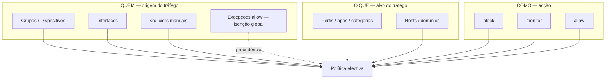

# Modelo conceptual da GUI Layer7

**SSOT conceptual.** Gate de revisão para futuras mudanças de interface.
Registado em `2026-07-30`. Plano de implementação:
[`docs/02-roadmap/plano-isencao-vip-e-ux-gui.md`](../02-roadmap/plano-isencao-vip-e-ux-gui.md).

---

## Finalidade

Este documento fixa o modelo mental único que a GUI Layer7 deve reflectir.
Qualquer campo novo, modal, badge ou atalho deve ser avaliado contra este
modelo antes de ser implementado.

---

## Conceitos canónicos

| Conceito | Definição | Armazenamento JSON | Precedência |
|----------|-----------|-------------------|-------------|
| **Política** | Regra que combina origem, alvo e acção para decidir tráfego | `layer7.policies[]` (máx. 24) | Ordem por prioridade; avaliada após excepções |
| **Perfil rápido** | Atalho de política pré-configurado (YouTube, redes sociais, etc.) | Catálogo em `profiles.json`; política gerada com id `profile-*` | Igual a política |
| **Grupo** | Conjunto nomeado de origens (CIDRs, hosts, dispositivos) | `layer7.groups[]` | Resolvido para IPs/CIDRs no momento da avaliação |
| **Dispositivo** | Entrada no inventário (MAC → IP via DHCP/ARP) | `layer7.devices[]` | Referenciado por grupos via `device_macs` |
| **Excepção** | Regra global de precedência máxima sobre políticas | `layer7.exceptions[]` (máx. 16) | **Primeira** na cadeia (daemon + PF `L7ALLOW`) |
| **Allowlist** | Destinos sempre permitidos pelo Layer7 (sem bypass do pfSense nativo) | `layer7.allowlist` | Marca PF `L7ALLOW`; não anula regras nativas |

**Distinção crítica:**

- **Excepção `allow`** = isenção global ("nunca bloquear esta origem pelo Layer7").
- **Allowlist** = destinos permitidos (lado destino), não origens.
- **Política `allow`** = acção permissiva dentro do escopo da política (não é isenção global).

---

## Modelo QUEM → O QUÊ → COMO

Toda decisão de filtragem decompõe-se em três eixos:

### QUEM (origem)

- **Positivo (incluir):** interfaces, grupos, `src_cidrs` numa política.
- **Negativo global (isentar):** excepção `allow` — o IP/dispositivo fica fora de *todas* as políticas Layer7.
- **Negativo por política (BG-066):** `src_exclude_*` — isento *desta* política, sujeito às restantes.

### O QUÊ (alvo)

- Perfis rápidos mapeiam apps/categorias/hosts conhecidos.
- Políticas manuais permitem combinações arbitrárias.

### COMO (acção)

- `block` — enforcement activo (PF + daemon).
- `monitor` — registo sem bloqueio.
- `allow` — decisão permissiva no escopo da política.

---

## Regra de ouro

> **Novos campos na GUI são atalhos para mecanismos existentes, nunca armazenamentos paralelos.**

Implicações:

1. O campo "Isentos" no modal de Perfis rápidos (BG-064) gere a excepção canónica `vip-isentos` — não cria um campo `isentos` separado no JSON.
2. Grupos são a moeda preferida para "quem"; CIDRs manuais ficam em secção Avançada.
3. O verificador (`layer7_test.php`, BG-065) explica o veredicto usando os mesmos mecanismos — não inventa regras paralelas.
4. Exclusão por política (BG-066) usa `match.src_exclude_*` no schema existente de políticas.

**Teste de conformidade:** se um campo novo grava dados que o daemon não lê, ou duplica um array existente, viola a regra de ouro.

---

## Matriz de superfícies GUI

| Superfície | Ficheiro | QUEM | O QUÊ | COMO | Notas |
|------------|----------|------|-------|------|-------|
| Estado | `layer7_status.php` | — | — | — | Dashboard; sem mutação |
| Dispositivos | `layer7_devices.php` | Inventário | — | — | Alimenta grupos |
| Grupos | `layer7_groups.php` | CRUD grupos | — | — | Moeda única de origem |
| Políticas (manual) | `layer7_policies.php` | ifaces, grupos, CIDRs | apps, cats, hosts | acção | Formulário completo |
| Perfis rápidos | `layer7_policies.php` | modal: ifaces, grupos, CIDRs | perfil pré-definido | acção | Atalho → política `profile-*` |
| Isentos VIP (plan.) | `layer7_policies.php` modal | atalho → excepção `vip-isentos` | — | allow global | BG-064 |
| Excepções | `layer7_exceptions.php` | hosts, CIDRs, ifaces | — | allow/block/monitor | Precedência máxima |
| Allowlist | `layer7_allowlist.php` | — | destinos | allow (PF tag) | Lado destino |
| Blacklists | `layer7_blacklists.php` | — | listas UT1 | block | Consumo F4 |
| Teste / verificador | `layer7_test.php` | IP simulado | domínio/app | veredicto | BG-065: motivo legível |
| Definições | `layer7_settings.php` | interfaces globais | block page, DNS | mode enforce/monitor | Toggle global |
| Eventos | `layer7_events.php` | — | — | — | Auditoria |
| Relatórios | `layer7_reports.php` | — | — | — | Leitura |
| Diagnósticos | `layer7_diagnostics.php` | — | — | — | Suporte |

### Navegação principal (menu)

Ordem canónica em `layer7_nav_tabs()` (`layer7.inc`):

Estado → Dispositivos → Políticas → Blacklists → Allowlist → Eventos → Relatórios → Definições

Excepções, Grupos, Teste e Diagnósticos acedem via sub-links ou tabs contextuais nas páginas de políticas.

---

## Cadeia de decisão (referência)

Ordem efectiva no daemon (`layer7_decide_for_client`, `policy.c`):

1. Excepções (`allow` → PERMITIDO; `block` → BLOQUEADO).
2. Políticas por prioridade (match origem + alvo + acção).
3. Default do sistema (modo monitor/enforce, allowlist-seed, etc.).

A simulação em `layer7_test.php` deve espelhar esta ordem (BG-065).

---

## Gates de revisão GUI

Antes de merge de qualquer mudança de interface:

- [ ] O campo novo é atalho ou armazenamento paralelo? (regra de ouro)
- [ ] QUEM/O QUÊ/COMO estão identificados no PR/commit?
- [ ] Traduções `en.php` actualizadas?
- [ ] `toggle_profile_off` / remoções não apagam dados partilhados inadvertidamente?
- [ ] Este documento e o plano SSOT foram actualizados se o modelo mudou?

---

## Referências

- Precedência: [`docs/core/precedence.md`](../core/precedence.md)
- ADR excepções PF: ADR-0016
- ADR grupos/dispositivos: ADR-0012
- Plano VIP/UX: [`plano-isencao-vip-e-ux-gui.md`](../02-roadmap/plano-isencao-vip-e-ux-gui.md)
