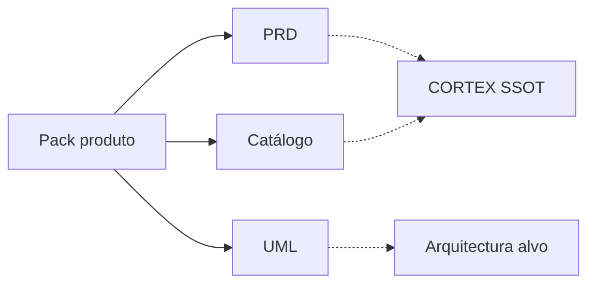

# Pack de produto — Layer7

**Classificação:** Canónico (índice do pack)  
**Actualizado:** `2026-08-10`  
**Canal `latest` publicado:** `1.9.47` · **Candidato local:** `1.9.48` (não publicado)  
**Pin enforce:** `1.9.8` · **SSOT vivo:** [`../../CORTEX.md`](../../CORTEX.md)

Este é o **ponto de entrada** do pack de produto. Lê-se em 2–5 minutos;
os três documentos abaixo aprofundam sem duplicar o CORTEX.

---

## Navegação do pack

| # | Documento | O que responde | Tempo |
|---|-----------|----------------|-------|
| 1 | **[PRD](prd-layer7.md)** | Problema, personas, requisitos, aceitação, fora de escopo | 10 min |
| 2 | **[UML](uml-layer7.md)** | Fronteiras (classes) + sequências (licença, enforce, report, MITM) | 8 min |
| 3 | **[Catálogo](catalogo-funcionalidades.md)** | O que existe e em que estado (Produção / Lab / NO-GO) | 8 min |

---

## Estado em 30 segundos

| Dimensão | Valor |
|----------|-------|
| Núcleo V1 | **Pronto para enforce** (excepções ADR-0022 CE, ADR-0023 fase 0) |
| Identity (rede) | Trilha **FECHADA** no âmbito documentado |
| MITM TLS | Lab opt-in; permanente **NO-GO** sem ficha + GO |
| Reportar erro | Candidato GUI `1.9.48` — opt-in GitHub, sem telemetria |

---

## Como funciona «Reportar erro»

Fluxo único, intencional: **descrever → pré-visualizar metadados seguros → abrir issue (ou copiar URL)**.

| Passo | Onde / o quê |
|-------|----------------|
| 1. Onde | GUI → **Services → Layer 7 → Diagnósticos** → bloco *Reportar erro* |
| 2. Preencher | Descrição curta (opcional, ≤500 chars) do sintoma |
| 3. Pré-visualizar | Metadados seguros já visíveis: versão pkg/daemon, running/stopped, enabled, mode, enforcement model, nº de interfaces, flag MITM (`off` / `configured_on`) |
| 4. Clique | **Abrir issue no GitHub** → redirect para `issues/new` com título/corpo pré-preenchidos |
| 5. Fallback | **Copiar URL** se não houver outbound, popup bloqueado ou headers já enviados |
| 6. No GitHub | Login → completar passos de reprodução → **Submit new issue** |
| 7. Privacidade | **Nunca** anexa `.lic`, chaves, senhas, logs brutos, dumps, hostnames, IPs de clientes nem regras PF completas. Sem upload automático. Sem backend de telemetria. |

Detalhe nos diagramas: [UML § Reportar erro](uml-layer7.md#3-reportar-erro-gui).  
Requisito: [PRD RF-09](prd-layer7.md#4-requisitos-funcionais).

---

## Legenda de status (partilhada)

| Badge | Significado |
|-------|-------------|
| **Produção** | No pin enforce `1.9.8` (e superiores com GO) |
| **Lab / latest** | No canal `latest`; pode não estar no pin |
| **Experimental** | Existe; OFF por defeito; gates/limites |
| **Candidato** | Código/docs locais; **não** em release pública |
| **NO-GO / DEFER** | Activação bloqueada |
| **Planeado** | Backlog sem implementação de produto |
| **Fora de escopo** | Explicitamente excluído |

---

## Leitura relacionada (fora do pack)

| Necessidade | Documento |
|-------------|-----------|
| Operação / install | [`../10-license-server/MANUAL-INSTALL.md`](../10-license-server/MANUAL-INSTALL.md) |
| Manual operador | [`../MANUAL-PRODUTO.md`](../MANUAL-PRODUTO.md) |
| Identity + MITM | [`START-HERE-identity-mitm.md`](START-HERE-identity-mitm.md) |
| Fecho de filas | [`ESTADO-PRODUTO-E-PLANOS-FECHADOS.md`](ESTADO-PRODUTO-E-PLANOS-FECHADOS.md) |
| Charter curto | [`product-charter.md`](product-charter.md) |

> Em conflito documental, prevalece o `CORTEX.md`.
