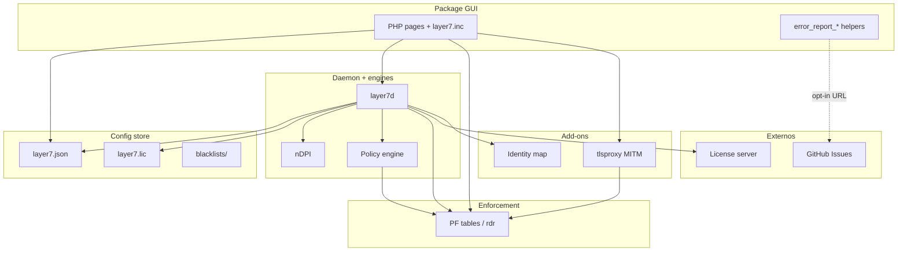
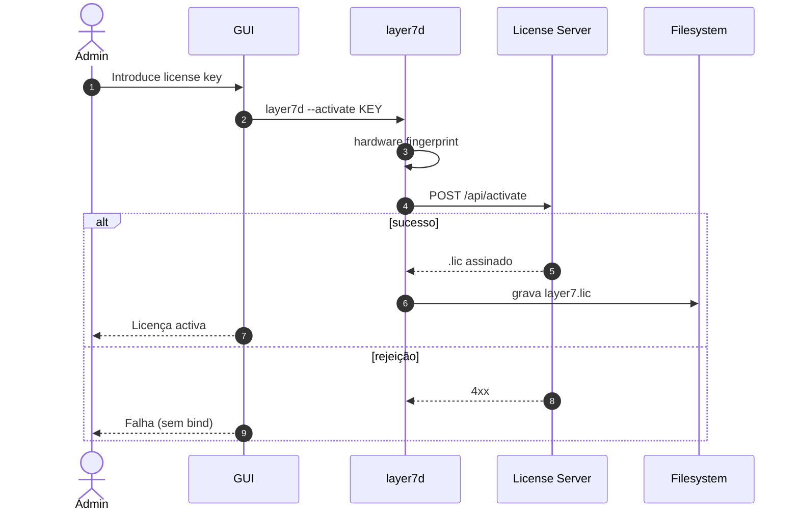
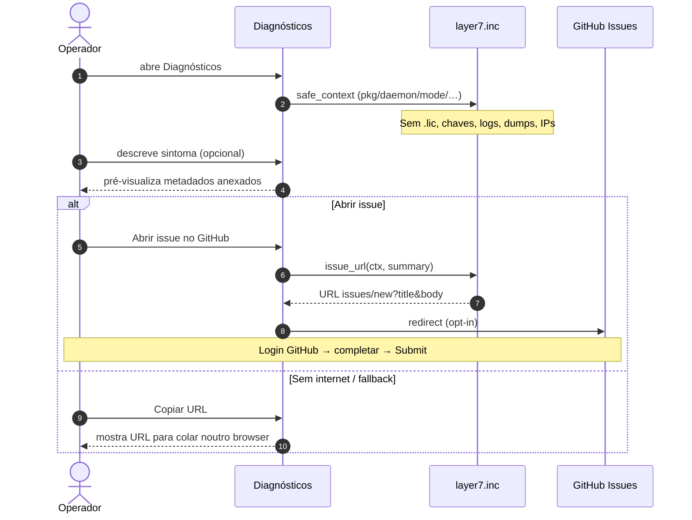
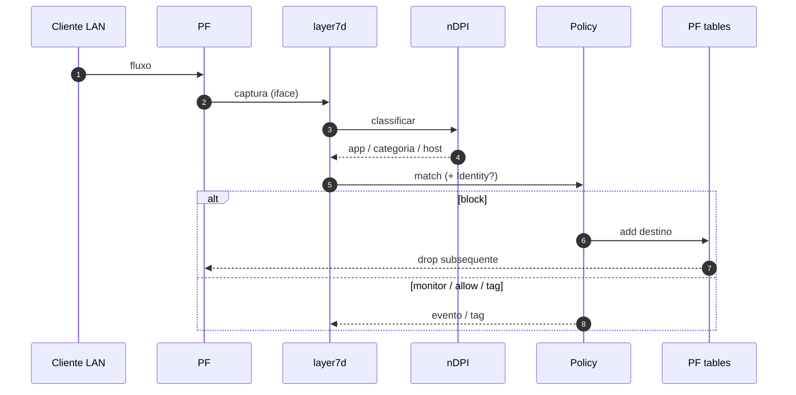
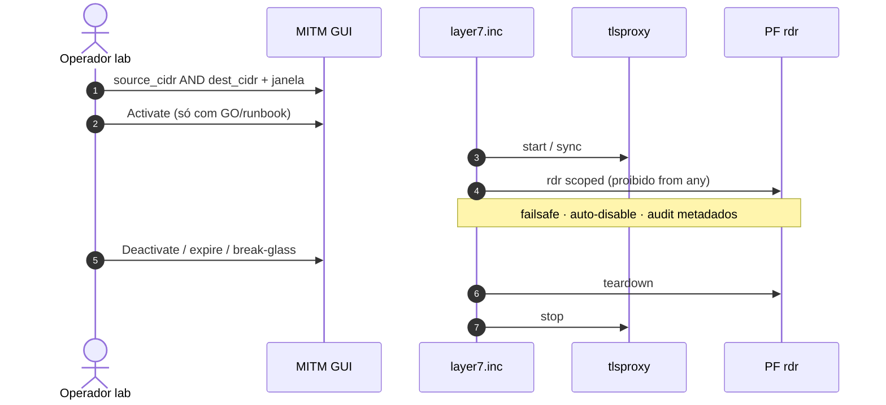

# UML — Layer7

**Pack:** [`pack-produto-layer7.md`](pack-produto-layer7.md) · **PRD:** [`prd-layer7.md`](prd-layer7.md) · **Catálogo:** [`catalogo-funcionalidades.md`](catalogo-funcionalidades.md)  
**Classificação:** Canónico · **Arquitectura:** [`../01-architecture/target-architecture.md`](../01-architecture/target-architecture.md)  
**Core:** [`../core/README.md`](../core/README.md)

> Mermaid de fronteiras e sequências. Não gera código. Reflecte o estado real.

---

## Índice

1. [Classes (visão lógica)](#1-classes-visão-lógica)
2. [Activação de licença](#2-activação-de-licença)
3. [Reportar erro (GUI)](#3-reportar-erro-gui)
4. [Classificação e enforcement](#4-classificação-e-enforcement)
5. [MITM opt-in (lab)](#5-mitm-opt-in-lab)
6. [Limites do modelo](#6-limites-do-modelo)

---

## 1. Classes (visão lógica)

| Bloco | Código / docs |
|-------|----------------|
| Package GUI | `package/pfSense-pkg-layer7/files/...` |
| layer7d | `src/layer7d/` |
| License server | `license-server/` |
| MITM | ADR-0026 |
| Identity | ADR-0027 / 0029 |

---

## 2. Activação de licença

---

## 3. Reportar erro (GUI)

Fluxo único: descrever → pré-visualizar metadados seguros → abrir GitHub **ou** copiar URL.

| Anexa | Nunca anexa |
|-------|-------------|
| Versão pacote / daemon | Ficheiro `.lic` |
| Daemon running/stopped | Chaves / senhas |
| enabled · mode · model | Logs brutos / dumps |
| Contagem de interfaces | Hostnames / IPs de clientes |
| Flag MITM (`off` / `configured_on`) | Regras PF completas |

Narrativa: [`pack-produto-layer7.md#como-funciona-reportar-erro`](pack-produto-layer7.md#como-funciona-reportar-erro).

---

## 4. Classificação e enforcement

---

## 5. MITM opt-in (lab)

Permanente **NO-GO** sem ficha nomeada + GO. Default OFF.

---

## 6. Limites do modelo

- Não modela cada ficheiro PHP/C — só fronteiras.
- Portal admin de licenças = UI do License Server (versão visual própria).
- Scripts de fleet SSH são operacionais externos (fora do runtime appliance).
