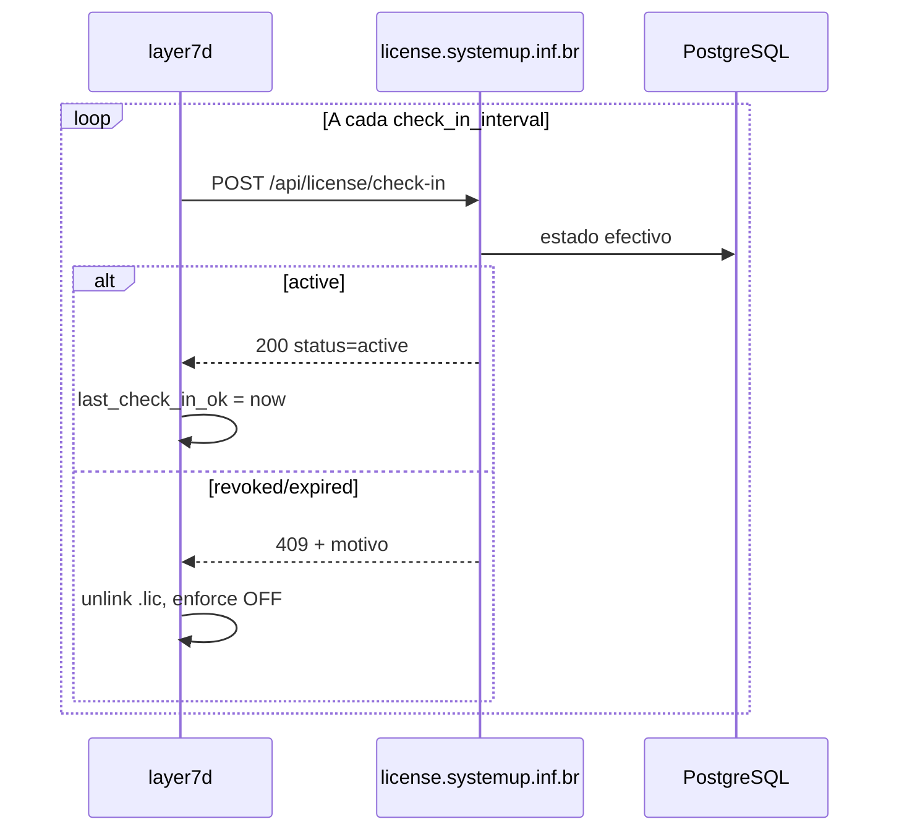

# Plano — Check-in online e revogação remota (BG-077)

## Finalidade

Fechar a lacuna comercial **crítica**: revogar/cancelar uma licença no servidor
deve fazer o appliance deixar de operar em enforce dentro de um prazo previsível,
sem depender de acesso ao pfSense do cliente.

**Decisão normativa:** [ADR-0021](../03-adr/ADR-0021-check-in-online-e-revogacao-remota.md)  
**Backlog:** BG-077  
**Estado:** planeamento aprovado para implementação; código **pendente**.

---

## Situação actual (pós F3.3)

| Acção no servidor | Efeito no appliance com `.lic` instalado |
|-----------------|------------------------------------------|
| Revogar | ❌ Nenhum (offline) |
| Expirar por data | ⏳ Só quando `expiry + 14d` grace local |
| Re-check daemon (1 h) | Só lê ficheiro local |

---

## Objectivo de produto

> **Cancelamento comercial:** operador revoga no painel → cliente perde enforce
> no máximo após **1 intervalo de check-in** (default **7 dias**, configurável
> até **24 h**).

---

## Arquitectura proposta

---

## Parâmetros propostos (defaults)

| Parâmetro | Valor default | Configurável |
|-----------|---------------|----------------|
| `check_in_interval_hours` | 168 (7 dias) | 24–720 h |
| `max_offline_hours` | 336 (14 dias) | 48–720 h |
| Rate limit API | 10 req/min/IP | igual activate |
| Feature flag pacote | `check_in_enabled` OFF → ON | `layer7.json` |

Persistência local proposta: `/var/db/layer7-checkin.json` (ou campo em
`layer7.json`) com `last_check_in_ok`, `last_check_in_attempt`, último erro.

---

## Blocos de implementação

### Bloco 1 — License server (prioridade)

- [ ] Rota `POST /api/license/check-in`
- [ ] Reutilizar `getEffectiveLicenseState`, `createHardwareBindingError`
- [ ] Tabela ou extensão `check_ins_log` (license_id, hw, result, ip, ts)
- [ ] Testes unitários + integração (active, revoked, expired, wrong hw)
- [ ] Deploy em `192.168.100.244`

### Bloco 2 — Daemon

- [ ] `layer7_check_in()` em `license.c`
- [ ] Scheduler no loop principal (`main.c`)
- [ ] Invalidação: `unlink(.lic)` + `s_license_state=0` + downgrade enforce
- [ ] Stats JSON: `license_check_in_ok`, `license_last_check_in`, `license_next_check_in`
- [ ] `PORTREVISION` novo + build builder

### Bloco 3 — Validação F3

- [ ] Cenário **S14** (novo): revogar → forçar check-in (ou esperar intervalo
  reduzido em lab) → `license_valid=false`
- [ ] Actualizar S09: pós-BG-077, veredicto esperado muda para **revogação remota**
- [ ] Evidência em `docs/tests/evidence/`

### Bloco 4 — Documentação e operação

- [ ] `MANUAL-USO-LICENCAS.md` — secção cancelamento comercial
- [ ] `PLANO-LICENSE-SERVER.md` — endpoint
- [ ] Runbook: "cliente cancelou — o que esperar e quando"

---

## Critérios de aceitação (GO)

1. Revogação no servidor + appliance online → enforce desliga em ≤ 1× intervalo.
2. Sem rede > `max_offline_hours` → monitor-only com mensagem clara.
3. Licença activa válida com rede → sem regressão em activação S01/S02.
4. Rate limit e logs auditáveis no backend.
5. Feature flag OFF → comportamento idêntico ao actual (rollback).

---

## Risco e mitigação

| Risco | Mitigação |
|-------|-----------|
| Cliente sem Internet prolongada | `max_offline_hours`; contrato declara requisito |
| Falso positivo de rede | não revogar localmente só por timeout de rede |
| Carga no servidor | intervalo mínimo 24 h; rate limit |
| Air-gap | flag OFF ou contrato sem check-in |

---

## Ordem sugerida no roadmap

1. **Imediato após fecho parcial F3** (ou em paralelo com Onda D se recursos).
2. Antes de GO produção enforce amplo (Onda F) — **recomendado bloqueante comercial**.

---

## Ligações

- [ADR-0021](../03-adr/ADR-0021-check-in-online-e-revogacao-remota.md)
- [f3-expiracao-revogacao-grace.md](f3-expiracao-revogacao-grace.md)
- [MANUAL-USO-LICENCAS.md](../10-license-server/MANUAL-USO-LICENCAS.md)
