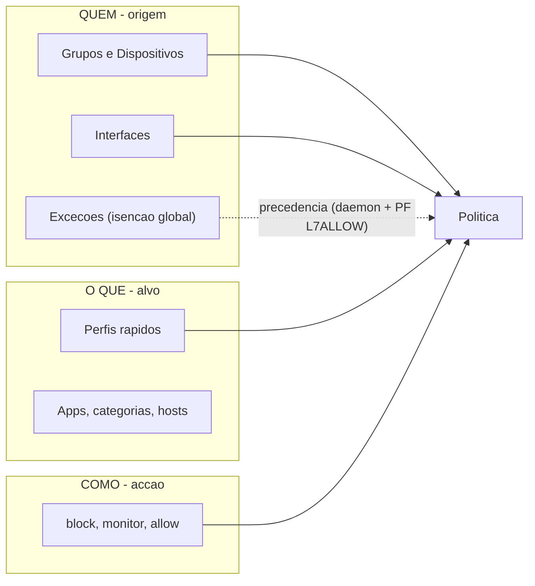

# Plano — Isenções VIP nos Perfis rápidos e consolidação UX da GUI

**SSOT do plano.** Registado em `2026-07-30`. Backlog: **BG-064**, **BG-065**, **BG-066**.
Modelo conceptual: [`docs/00-overview/modelo-conceptual-gui.md`](../00-overview/modelo-conceptual-gui.md).

---

## Contexto e princípios

Estado actual verificado no código:

- O mecanismo de isenção **já existe**: excepções (`layer7["exceptions"]`, máx. 16) com acção `allow` têm precedência sobre políticas no daemon (`layer7_decide_for_client` em `src/layer7d/policy.c`) e no PF (tabelas `layer7_exc_allow_N` + `tag L7ALLOW`, ADR-0016).
- O modal "Opções" dos Perfis rápidos (`layer7_policies.php`, linhas 748–813) só tem selecção positiva (acção, interfaces, CIDRs, grupos).
- Grupos já aceitam `cidrs`, `hosts` e `device_macs` (resolvidos para IP via inventário — ADR-0012), ou seja, "isentar um PC" = dispositivo num grupo.
- Já existe simulador (`layer7_test.php`) que avalia excepções e políticas para um IP/domínio/app.
- Estado do repo: release pública `1.8.11_47`; último BG = BG-063; último ADR = ADR-0018; **NO-GO vigente para enforce em produção** (gates G2–G7 pendentes) — nada neste plano altera esse veredicto.

Princípios de desenho (anti-duplicação):

1. Modelo mental único **QUEM → O QUÊ → COMO**; isenção = "QUEM negativo".
2. **Regra de ouro:** novos campos na GUI são *atalhos* para mecanismos existentes, nunca armazenamentos paralelos.
3. Grupos são a moeda única para "quem" (grupo "Gestores/VIPs"); CIDRs manuais viram opção avançada.
4. Investir no "porquê" (verificador de política efectiva) em vez de multiplicar controlos.

---

## Bloco A — Governança documental (F0-like, sem código)

1. Gravar este plano como SSOT em `docs/02-roadmap/plano-isencao-vip-e-ux-gui.md`.
2. Criar `docs/00-overview/modelo-conceptual-gui.md`: conceitos canónicos (Política, Perfil, Grupo, Excepção, Allowlist, Dispositivo), o modelo QUEM/O QUÊ/COMO, a regra de ouro e a matriz das superfícies actuais da GUI. Passa a ser gate de revisão para futuras mudanças de GUI.
3. Registar no [backlog.md](backlog.md):
   - **BG-064** — Isenção VIP nos Perfis rápidos (atalho para excepções; Bloco B).
   - **BG-065** — UX do modal (progressive disclosure, grupos-first) + verificador de política efectiva (Bloco C).
   - **BG-066** — Exclusão por política `src_exclude_*` no daemon/PF + ADR-0019 (Bloco D).
4. Actualizar `CORTEX.md`, roadmap e checklist mestre (matriz mínima do AGENTS.md).

**Rollback:** reverter commits documentais. **Risco:** nulo.

---

## Bloco B — Fase 1: isenção VIP no modal (só PHP, candidato `_48`)

Semântica escolhida (endossada na conversa): a isenção é **global e honesta** — o campo do modal gere uma excepção canónica partilhada (id fixo `vip-isentos`, acção `allow`, prioridade alta), não uma excepção por perfil. Zero conceitos novos; com 18 perfis e limite de 16 excepções, excepções por perfil não escalariam.

1. `layer7_policies.php` — modal "Opções": nova secção "Isentos (nunca bloqueados)" que mostra o conteúdo actual da excepção `vip-isentos` e permite acrescentar grupos e/ou IPs/CIDRs. Aviso explícito: "isenção vale para todos os perfis Layer7". Handler `add_profile_policy` cria/actualiza essa excepção via o fluxo já validado (`layer7_save_json` + `layer7_pf_config_resync`).
2. Suportar **grupos** na excepção VIP: expandir grupos para hosts/cidrs no momento da gravação (mesmo padrão de resolução `device_macs → device_ips` já usado nas políticas), mantendo o schema de excepção actual (`hosts`/`cidrs`) — sem tocar no daemon.
3. `layer7_exceptions.php`: marcar visualmente a excepção gerida `vip-isentos` (badge "gerida pelos Perfis rápidos") — continua editável lá; um sítio só de verdade.
4. `toggle_profile_off` **não** remove a excepção (é partilhada); documentar no help-block.
5. Traduções em `files/usr/local/etc/layer7/lang/en.php`.
6. Docs no mesmo bloco: `MANUAL-INSTALL.md` (se houver impacto operacional), changelog, CORTEX, backlog.
7. `PORTREVISION=48`, build no builder FreeBSD (fluxo padrão do AGENTS.md), validação do pacote, publicação em `pablomichelin/Layer7` com `.pkg` + `.sha256` quando autorizado.

**Teste mínimo:** `php -l` em todos os PHP tocados; suite run-local existente; caso novo em teste PHP funcional (padrão `tests/functional/test_scoped_pf_inc.php`) cobrindo criação/actualização da excepção VIP e expansão de grupos.

**Rollback:** reinstalar `_47`.

---

## Bloco C — Fase 2: UX do modal + verificador "porquê" (só PHP, candidato `_49`)

1. Progressive disclosure no modal: nível essencial = Acção, "Aplicar a" (interfaces + grupos), "Isentos"; secção "Avançado" recolhida = CIDRs manuais. Nenhum campo removido — só reorganizado (não-regressão).
2. Grupos-first: se não existir nenhum grupo, o modal mostra atalho "criar grupo (ex.: Gestores)" para `layer7_groups.php`.
3. `layer7_test.php` como "verificador de política efectiva": veredicto destacado com motivo legível ("PERMITIDO — excepção `vip-isentos`"; "BLOQUEADO — política `profile-youtube`"), garantindo que a avaliação simulada espelha a cadeia real (excepções → políticas → default). Link "Testar" a partir do modal.
4. Traduções, docs, changelog, `PORTREVISION=49`, build + release (mesmo fluxo do Bloco B).

**Rollback:** reinstalar `_48`. **Risco:** baixo (apresentação); atenção a paridade da simulação com `layer7_decide_for_client`.

---

## Bloco D — Fase 3: exclusão por política no daemon (C + PHP, ADR-0019, candidato `_50`)

Para o caso fino "isento só deste perfil" (o IP continua sujeito aos outros), exposto apenas na secção "Avançado".

1. **ADR-0019** — exclusão de origem por política: campos `match.src_exclude_cidrs` e `match.src_exclude_groups`; semântica por `enforcement_model`:
   - `scoped_hybrid`: tabela PF `layer7_pexc_N` por política + regra `match from <layer7_pexc_N> to <layer7_pdst_N> tag L7ALLOW` (mesmo padrão do `pallow`/ADR-0016);
   - `legacy_global`: exclusão avaliada no daemon (não adiciona o destino por causa daquele cliente), com a limitação declarada de que um destino já em `layer7_block_dst` por outro cliente continua bloqueado — trade-off documentado no ADR.
2. Daemon `src/layer7d/policy.c`: parse dos novos arrays (padrão `parse_cidr_array_in_object`), resolução de grupos excluídos (padrão da linha ~814) e não-match em `rule_matches_src` quando a origem cai na exclusão.
3. Pacote `layer7.inc`: declaração das tabelas `layer7_pexc_N`, regras, inclusão em `layer7_flush_dynamic_tables()`, self-heal e `layer7-pfctl flush-all` (lição do BG-061: cobertura de flush completa desde o início).
4. GUI: campo "Excluir origens (só este perfil)" na secção Avançado do modal e no formulário manual de política; validação de conflito (origem simultaneamente incluída e excluída → erro).
5. Testes: novos casos em `tests/functional/test_policy_decide.c` (decisão com exclusão), `test_config_parse.c` (parse), `test_scoped_pf_inc.php` (regras PF geradas), `tests/unit/test_flush_coverage.sh` (tabelas `pexc`).
6. Docs: `docs/core/policy-matrix.md`, `docs/core/precedence.md`, `docs/05-daemon/pf-enforcement.md`, changelog, CORTEX, backlog. `PORTREVISION=50`, build + release.

**Rollback:** reinstalar `_49`; campos novos são ignorados por versões antigas do daemon (aditivos ao JSON). **Risco:** médio — é o único bloco que toca C/enforcement; não avança sem os blocos B/C fechados e sem ADR aprovado.

---

## Bloco E — Validação integrada e gates

1. Nova secção no roteiro `docs/04-package/validacao-lab.md`: cenário **«director
   isento de tudo»** (sec. **20**) — perfil block + blacklist UT1 + block page ON;
   VIP na `vip-isentos` navega livremente incluindo domínios sinkhole; cliente
   não-VIP bloqueado; verificação modo DNS (a)/(b); host overrides nativos
   (ADR-0020). Complementa sec. **19** (gestor isento / verificador).
2. Smoke no appliance com snapshot/rollback (padrão BG-060); paragem obrigatória para validação humana antes de qualquer activação de enforce em produção — o NO-GO vigente (gates G2–G7) não é alterado por este plano.

---

## Instruções de execução

- **Ordem estrita entre blocos: A → B → C → D → E.** B, C e D tocam os mesmos ficheiros (`layer7_policies.php`, `layer7.inc`) — não paralelizar blocos entre si.
- Paralelizável **dentro** de cada bloco: no A, os quatro documentos; no B, GUI vs teste funcional vs traduções; no D, ADR/docs vs testes.
- Cada bloco termina com: docs actualizadas no mesmo commit, testes PASS, commit local, e (para B/C/D) build no builder + release em `pablomichelin/Layer7` antes de iniciar o bloco seguinte (quando autorizado).
- Regras invioláveis do AGENTS.md aplicam-se: ler `CORTEX.md` antes de agir, não mover/renomear ficheiros, não commitar `src/layer7d/license.c`/`Makefile` locais do builder, declarar objectivo/impacto/risco/teste/rollback por entrega.

---

## Estado de execução

| Bloco | Descrição | PORTREVISION | Status |
|-------|-----------|--------------|--------|
| A | Governança documental | — | Concluído (`2026-07-30`) |
| B | Isenção VIP modal | `_48` | Concluído código (`2026-07-30`); build/release pendente |
| C | UX modal + verificador | `_49` | Concluído código (`2026-07-30`); build/release pendente |
| D | Exclusão por política | `_50` | Concluído código (`2026-07-30`); build/release pendente |
| E | Validação lab | — | Concluído documental (`validacao-lab` sec. **20**); execução appliance pendente |
