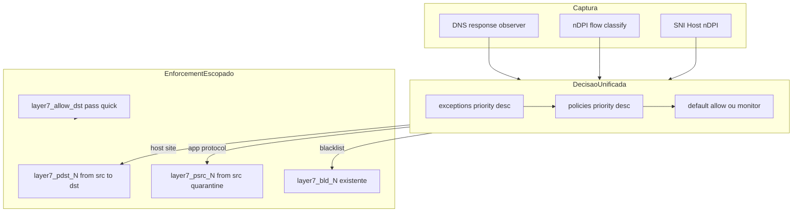

# Caminho B — Plano Enforcement 100% (Layer7 funcional tipo UDM Pro)

> **SSOT deste plano:** este ficheiro.  
> **Estado:** aprovado para execucao (2026-06-15).  
> **Versao base do produto:** `1.8.11_23` (Caminho A A0–A5 concluido).  
> **Gap que este plano fecha:** decisao per-client vs imposicao PF global.

---

## Como usar este documento (handoff para chat novo / multitask)

1. Ler primeiro: [`CORTEX.md`](../../CORTEX.md), [`AGENTS.md`](../../AGENTS.md), este ficheiro.
2. Executar **um bloco de cada vez** (E0 → E8), na ordem. Nao saltar E2/E3.
3. Marcar checkboxes em [Progresso](#progresso-checklist) ao concluir cada bloco.
4. Cada bloco exige: codigo + docs no mesmo commit + teste minimo + rollback declarado.
5. **MVP funcional:** E0 + E1 + E2 + E3 + E7 (smoke two-client no appliance).
6. **100%:** todos os criterios em [Definition of Done](#definition-of-done--100).

### Prompt modelo para chat novo

```text
Continuar o Caminho B (Enforcement 100%) do Layer7 para pfSense CE.

Leia obrigatoriamente:
- CORTEX.md
- docs/09-blocking/plano-enforcement-100-porcento.md

Execute apenas o bloco EX indicado abaixo (nao avance ao seguinte sem gate).
Respeite AGENTS.md: bloco pequeno, reversivel, docs no mesmo bloco, sem regressao.

Bloco alvo: E_
Estado actual: (copiar checkboxes de progresso deste ficheiro)

Entregar: resumo, ficheiros, implementacao, teste minimo, risco, rollback, docs actualizadas.
```

---

## Resumo executivo

O Layer7 **classifica e decide** politicas por cliente/grupo/interface/prioridade, mas **impoe bloqueio de forma global** via tabela PF unica `layer7_block_dst`. Por isso:

- Bloquear YouTube para o filho pode bloquear YouTube para toda a LAN (**com `legacy_global`**, default).
- A GUI promete politicas por dispositivo/grupo; com **`legacy_global`** o PF nao cumpre per-client.
- **Pos-E1/E3 (codigo actual):** DNS e nDPI usam `layer7_decide_for_client()` em ambos os modos;
  a limitacao legacy e **runtime PF** (`layer7_block_dst` global), nao o atalho
  `layer7_domain_is_blocked()` (deprecado em runtime).

O **Caminho A** (inventario, MAC→IP, SNI opt-in, UX perfis) esta concluido em `1.8.11_23`, mas **nao corrigiu enforcement**. Este **Caminho B** corrige a camada PF e unifica decisao.

**Modelo escolhido (hibrido — mais eficaz e seguro):**

| Tipo | Enforcement PF | Exemplo |
|------|----------------|---------|
| Site / dominio / host / SNI | `from {cliente} to <layer7_pdst_N>` | YouTube so para IP 10.0.0.10 |
| App / categoria nDPI | `from <layer7_psrc_N> to !<localsubnets>` | BitTorrent: quarentena so do cliente |
| Sem origem definida | Global **opt-in** (`scope_global: true`) | Politica explicitamente global |
| Blacklists UT1 | Manter `layer7_bld_N` (ja escopado) | Sem regressao |

Transicao segura: flag `layer7.enforcement_model`:
- `legacy_global` (default ate E8) — comportamento actual
- `scoped_hybrid` — novo modelo

---

## Diagnostico confirmado (analise estatica 2026-06-15)

### Causa raiz

```text
Captura (DNS / nDPI / SNI)
    → Decisao (policy.c — per-client, prioridade, excepcoes)  ✓
    → Enforcement (main.c + layer7.inc — layer7_block_dst GLOBAL)  ✗
```

### Evidencia no codigo

| Problema (pre-E1) | Ficheiro | Estado pos-E1/E3 |
|----------|----------|------------------|
| DNS ignorava cliente na imposicao PF global | `main.c` `layer7_on_dns_resolved` | **Corrigido em decisao** via `layer7_decide_for_client(client_ip)`; legacy ainda popula `layer7_block_dst` |
| Atalho DNS incompleto (`layer7_domain_is_blocked`) | `policy.c` | **Nao usado em runtime** desde E1; funcao mantida para compat/tests |
| nDPI decide certo, aplica global | `main.c` `layer7_on_classified_flow` | **Scoped:** `layer7_pdst_N`/`layer7_psrc_N`; **legacy:** `layer7_block_dst` |
| PF global sem `from` | `layer7.inc` | Inalterado em `legacy_global`; E2 gera regras `from … to <layer7_pdst_N>` em `scoped_hybrid` |
| App+host = OR (alarga bloqueio) | `src/layer7d/policy.c` | `rule_matches()` |
| Blacklists escopadas (modelo certo) | `package/.../layer7.inc` | `from {cidr} to <layer7_bld_N>` |
| CLI `-e` vs runtime divergem | `src/layer7d/enforce.c` vs `main.c` | CLI sugere `layer7_block`; runtime usa `block_dst` |
| Match vazio = catch-all | `src/layer7d/policy.c` | `rule_matches()` retorna 1 sem criterios |
| Campos docs nao implementados | `docs/core/policy-matrix.md` vs `policy.c` | `ndpi_master`, `dst_port`, `dst_net` |
| IPv4 only | `src/layer7d/capture.c` | `ip_v != 4` descartado |
| Sem testes policy engine | `tests/run-local.sh` | so allowlist + config_parse |
| Licenca invalida → monitor | `src/layer7d/main.c` | `refresh_enforce_cfg()` |

### O que NAO precisa ser deitado fora

- Motor `layer7_flow_decide()` (base boa)
- Blacklists `layer7_bld_N`
- Allowlist `layer7_allow_dst`
- nDPI, capture, grupos, device_ips (A2)
- GUI de politicas/perfis/grupos

---

## Arquitectura alvo



### Novas estruturas propostas (E1)

Estender `struct layer7_decision` em [`src/layer7d/policy.h`](../../src/layer7d/policy.h):

```c
enum layer7_enforce_kind {
    L7_ENFORCE_NONE = 0,
    L7_ENFORCE_DST_SCOPED,   /* IP destino → layer7_pdst_N */
    L7_ENFORCE_SRC_SCOPED,   /* IP origem → layer7_psrc_N */
};

/* Campos novos em layer7_decision: */
enum layer7_enforce_kind enforce_kind;
int policy_table_idx;          /* indice N em layer7_pdst_N / layer7_psrc_N */
int scope_global;              /* 1 = politica global explicita */
char enforce_dst_ip[48];       /* IP a adicionar (destino ou origem) */
```

Funcao unificada (nome sugerido):

```c
int layer7_decide_for_client(
    const struct layer7_exception *exc, int n_exc,
    const struct layer7_policy_rule *rules, int n_rules,
    int global_enforce,
    const char *iface, const char *client_ip,
    const char *domain_or_host,   /* DNS/SNI; NULL em app-only */
    const char *ndpi_app, const char *ndpi_cat,
    struct layer7_decision *dec);
```

`layer7_domain_is_blocked()` → **deprecado em runtime**; mantido no codigo para compatibilidade/tests.

---

## Principios de execucao

1. **Um bloco por entrega** — reversivel, auditavel.
2. **Flag `legacy_global` default** ate E8 validado no appliance.
3. **Docs no mesmo bloco** que codigo (matriz abaixo).
4. **Teste minimo** antes de fechar bloco.
5. **Build FreeBSD** no builder antes de release (E8).
6. **Honestidade:** CDN, ECH, DoH hardcoded, IPv6 — limites documentados, nao prometer 100% magico.

### Infraestrutura (AGENTS.md)

| Recurso | Valor |
|---------|-------|
| Builder FreeBSD | `192.168.100.12`, SSH `root`, repo `/root/pfsense-layer7` |
| Appliance lab | `192.168.100.254` (validacao-lab.md) |
| Build | `cd package/pfSense-pkg-layer7 && make clean && DISABLE_LICENSES=yes make package` |

---

## Blocos de implementacao

### Bloco E0 — Fundacao, ADR e flag de rollback

**Objectivo:** preparar sem alterar comportamento default.

**Entregas:**
- [x] ADR: [`docs/03-adr/ADR-0014-enforcement-escopado-por-politica.md`](../03-adr/ADR-0014-enforcement-escopado-por-politica.md)
- [x] Campo JSON `layer7.enforcement_model`: `"legacy_global"` | `"scoped_hybrid"`
- [x] Parse em [`src/layer7d/config_parse.c`](../../src/layer7d/config_parse.c) + [`config_parse.h`](../../src/layer7d/config_parse.h)
- [x] Toggle/aviso em [`layer7_settings.php`](../../package/pfSense-pkg-layer7/files/usr/local/www/packages/layer7/layer7_settings.php) (default legacy, label claro)
- [x] Registar BG-045..BG-052 em [`docs/02-roadmap/backlog.md`](../02-roadmap/backlog.md)
- [x] Entrada em [`docs/03-adr/README.md`](../03-adr/README.md)
- [x] Actualizar [`docs/09-blocking/README.md`](README.md) com link a este plano
- [x] Nota em [`CORTEX.md`](../../CORTEX.md): Caminho B iniciado; gap Caminho A documentado

**Ficheiros afectados:** config_parse, layer7_settings.php, docs (lista acima)

**Teste minimo:**
```bash
sh tests/run-local.sh          # exit 0
# JSON sem enforcement_model → legacy_global implicito
# layer7d -t -c /path/to/config.json → parse OK
```

**Rollback:** remover campo; default = legacy.

**Risco:** baixo (so config + docs).

---

### Bloco E1 — Motor de decisao unificado

**Objectivo:** DNS, nDPI e SNI usam a mesma cadeia de decisao.

**Entregas:**
- [x] Implementar `layer7_decide_for_client()` em [`policy.c`](../../src/layer7d/policy.c) / [`policy.h`](../../src/layer7d/policy.h)
- [x] Estender `struct layer7_decision` (enforce_kind, policy_table_idx, etc.)
- [x] [`layer7_on_dns_resolved`](../../src/layer7d/main.c): passar `client_ip`; **ambos** os modos usam `layer7_decide_for_client()`; scoped → `layer7_pdst_N`; legacy → `layer7_block_dst`
- [x] Resolver indice estavel de politica: funcao `layer7_policy_table_index(rules, n, policy_id)` — mesma ordem que `layer7_policies_sort()`
- [x] Garantir: excepcoes → politicas (priority desc) → default allow/monitor
- [x] Novo [`tests/functional/test_policy_decide.c`](../../tests/functional/test_policy_decide.c)
- [x] Integrar teste em [`tests/run-local.sh`](../../tests/run-local.sh)

**Casos de teste obrigatorios (test_policy_decide.c):**

| # | Cenario | Esperado |
|---|---------|----------|
| 1 | Block YouTube src=10.0.0.10 | block, policy match |
| 2 | Mesmo dominio src=10.0.0.20, politica so para .10 | allow/default |
| 3 | Excepcao allow para .10 prevalece | allow |
| 4 | Politica allow pri=100 vs block pri=10 mesmo host | allow |
| 5 | Schedule inactivo | no block |
| 6 | Politica disabled | no block |
| 7 | Grupo expandido (src_cidrs de group) | block so dentro do grupo |

**Rollback:** `enforcement_model=legacy_global` repoe imposicao via `layer7_block_dst` (decisao continua unificada).

**Risco:** medio (logica core; coberto por testes unitarios).

---

### Bloco E2 — Geracao PF escopada no pacote

**Objectivo:** `layer7_generate_rules()` emite tabelas e regras por politica (copiar padrao blacklist).

**Entregas:**
- [x] Em [`layer7.inc`](../../package/pfSense-pkg-layer7/files/usr/local/pkg/layer7.inc):
  - Funcao `layer7_policy_enforcement_rules_text($data)` — so se `scoped_hybrid` + enforce
  - Por cada politica `enabled` + `action=block`:
    - Tabela `layer7_pdst_{idx}` se tem hosts ou perfil site
    - Tabela `layer7_psrc_{idx}` se tem ndpi_app/cat sem host (app-only)
    - Ambas se perfil misto (E5 refinara)
  - Regras PF por origem da politica (`match.src_hosts`, `match.src_cidrs`, grupos expandidos → CIDRs/hosts no JSON):
    ```text
    block drop quick inet from 10.0.0.10 to <layer7_pdst_0> label "layer7:pdst:policy_id"
    block drop quick inet from 10.0.0.0/24 to <layer7_pdst_1> label "layer7:pdst:..."
    block drop quick inet from <layer7_psrc_2> to !<localsubnets> label "layer7:psrc:..."
    ```
  - Politica sem origem: regra global **so** se `scope_global: true` (campo novo JSON + GUI checkbox "Aplicar a toda a rede")
- [x] `layer7_resync()` / `layer7_ensure_pf_table()` para `layer7_pdst_*` e `layer7_psrc_*`
- [x] [`layer7-pfctl`](../../package/pfSense-pkg-layer7/files/usr/local/libexec/layer7-pfctl): flush das novas tabelas no `flush-all`
- [x] [`main.c`](../../src/layer7d/main.c) `enforcement_flush_all_tables()`: incluir pdst/psrc
- [x] Em `legacy_global`: snippet actual inalterado

**Teste minimo:**
```bash
php -l package/pfSense-pkg-layer7/files/usr/local/pkg/layer7.inc
# Simular layer7_generate_rules com JSON scoped_hybrid → grep layer7_pdst
# Appliance: filter reload → grep layer7_pdst /tmp/rules.debug
```

**Rollback:** `enforcement_model=legacy_global`.

**Risco:** alto (PF ruleset); mitigar com `pfctl -nf` antes de reload.

---

### Bloco E3 — Daemon: enforcement segue decisao escopada

**Objectivo:** popular tabela da politica vencedora, nao `layer7_block_dst` global.

**Entregas:**
- [x] [`layer7_on_dns_resolved`](../../src/layer7d/main.c): pos-decisao block + scoped → `pfctl -t layer7_pdst_{idx} -T add {resolved_ip}`
- [x] [`layer7_on_classified_flow`](../../src/layer7d/main.c):
  - block + dst_scoped → add `dst_ip` a `layer7_pdst_{idx}`
  - block + src_scoped → add `src_ip` a `layer7_psrc_{idx}`
  - legacy_global → comportamento actual (block_dst)
- [x] Refactor cache TTL: chave `(table_name, ip)` em vez de so IP global
- [x] Allowlist gate **antes** de qualquer add (manter Bloco 3)
- [x] Alinhar [`enforce.c`](../../src/layer7d/enforce.c) / CLI `-e` com runtime scoped
- [x] Logs: incluir `enforce_kind`, `table`, `policy_id`
- [ ] **Gate appliance two-client** (A=10.0.0.10 vs B=10.0.0.20) — ver abaixo
  - **PENDENTE (2026-06-16):** build `1.8.11_23` OK no builder; instalacao/gate bloqueados (SSH Mac→254 timeout; credenciais builder→254; clientes lab inacessiveis). SSOT passos: [`validacao-lab.md` sec.12](../04-package/validacao-lab.md).

**Teste appliance (GATE OBRIGATORIO — nao avancar sem isto):**

```text
Setup:
  enforcement_model=scoped_hybrid, mode=enforce, enabled=true
  Politica P0: block youtube.com, src_hosts=[10.0.0.10]
  Clientes: A=10.0.0.10, B=10.0.0.20

Passos:
  1. De A: nslookup youtube.com (ou navegar)
  2. pfctl -t layer7_pdst_0 -T show  → contem IP YouTube
  3. pfctl -t layer7_block_dst -T show → VAZIO (modo scoped)
  4. De A: curl/https timeout para YouTube
  5. De B: curl/https para YouTube → SUCESSO
  6. Repetir com nDPI (app YouTube) se possivel
```

**Rollback:** flag legacy + flush tables.

**Risco:** critico — este bloco e o coracao do fix.

---

### Bloco E4 — Semantica de match e validacao GUI

**Objectivo:** parser, GUI e docs alinhados; eliminar surpresas.

**Entregas:**
- [ ] Campo politica `match_mode`: `"and"` (default) | `"or"`
- [ ] [`rule_matches()`](../../src/layer7d/policy.c): respeitar match_mode
- [ ] Perfis [`profiles.json`](../../package/pfSense-pkg-layer7/files/usr/local/etc/layer7/profiles.json): `"match_mode": "or"` onde fizer sentido
- [ ] GUI [`layer7_policies.php`](../../package/pfSense-pkg-layer7/files/usr/local/www/packages/layer7/layer7_policies.php):
  - Rejeitar ou aviso forte: politica block sem criterios de match
  - Campo scope_global
  - Campo match_mode (avancado)
- [ ] Decidir e implementar OU remover da GUI/docs: `ndpi_master`, `dst_port`, `dst_net`
- [ ] Accao `tag`: documentar ou emitir regra PF default para `layer7_tagged`
- [ ] Actualizar [`docs/core/policy-matrix.md`](../core/policy-matrix.md), [`precedence.md`](../core/precedence.md)

**Teste:** extensao `test_policy_decide.c` — AND vs OR; match vazio.

**Rollback:** revert parser/GUI fields.

**Risco:** medio (pode afectar perfis existentes — testar perfis rapidos).

---

### Bloco E5 — Modelo hibrido app vs site

**Objectivo:** classificar `enforce_kind` automaticamente.

**Regras:**

| Match da politica | enforce_kind | Tabela |
|-------------------|--------------|--------|
| hosts / domain / SNI (com ou sem app) | `dst_scoped` | `layer7_pdst_N` |
| so ndpi_app / ndpi_category | `src_scoped` | `layer7_psrc_N` |
| misto com match_mode=or e ambos casam | preferir dst se host presente | pdst |
| perfil composto (ex. youtube) | OR + dst para dominios + src se app-only path | ambas se necessario |

**Entregas:**
- [ ] Logica em `layer7_decide_for_client()` + E2 rules generation coerente
- [ ] Perfis rapidos geram kind correcto ao toggle ON ([`layer7_policies.php`](../../package/pfSense-pkg-layer7/files/usr/local/www/packages/layer7/layer7_policies.php))
- [ ] Lab: BitTorrent so quarentena cliente detectado

**Teste lab:** cenarios app vs site (validacao-lab sec. 12).

---

### Bloco E6 — SNI, CDN e anti-bypass

**Objectivo:** maximizar eficacia dentro dos limites sem MITM.

**Entregas:**
- [ ] GUI: aviso se politica tem hosts e `sni_inspection=false`
- [ ] Opcao politica `cdn_mode`: `permissive` | `strict` (strict exige SNI match para add a pdst)
- [ ] Documentar limites: ECH, DoH hardcoded, IPv6, CDN partilhado
- [ ] Revisar ordem PF: `pass quick to layer7_allow_dst` antes de blocks scoped
- [ ] Regra block_dst scoped usar `to !<localsubnets>` onde aplicavel (nao bloquear trafego interno acidental)

**Teste:** lab CDN; smoke anti-bypass existente nao regressa.

**Rollback:** cdn_mode=permissive; sni_inspection off.

---

### Bloco E7 — Rede de testes e validacao lab

**Objectivo:** rede de seguranca repetivel (fecha BG-012/013 para enforcement).

**Entregas:**
- [ ] [`tests/functional/test_policy_decide.c`](../../tests/functional/test_policy_decide.c) — completo
- [ ] Novo [`tests/lab/smoke-enforcement-scoped.sh`](../../tests/lab/smoke-enforcement-scoped.sh):
  ```bash
  # Modo estatico (workspace): verifica testes E1/E2/E3 e layer7.inc
  # Modo appliance: enforcement_model=scoped_hybrid, regras layer7_pdst, two-client (L7_CLIENT_A/B)
  ```
- [x] Script diagnostico [`scripts/diagnose-layer7-appliance.sh`](../../scripts/diagnose-layer7-appliance.sh) — versao, licenca, mode, tabelas PF, logs
- [ ] Actualizar [`docs/tests/test-matrix.md`](../tests/test-matrix.md) — pontos 13.x enforcement scoped
- [ ] Actualizar [`docs/04-package/validacao-lab.md`](../04-package/validacao-lab.md) — **seccao 12**
- [ ] [`layer7_diagnostics.php`](../../package/pfSense-pkg-layer7/files/usr/local/www/packages/layer7/layer7_diagnostics.php): mostrar enforcement_model, tabelas pdst/psrc por politica

**Gate global Caminho B:**
```bash
sh tests/run-local.sh                    # exit 0
sh tests/lab/smoke-monitor-mode.sh       # exit 0 (nao regressao Fase 1)
sh tests/lab/smoke-enforcement-scoped.sh # exit 0 no appliance
```

**Rollback:** N/A (so testes/docs).

---

### Bloco E8 — Release, default scoped, migracao

**Objectivo:** produto 100% operacional; legacy so para emergencia.

**Entregas:**
- [ ] Default `enforcement_model=scoped_hybrid` em [`layer7_bare_config()`](../../package/pfSense-pkg-layer7/files/usr/local/pkg/layer7.inc) e sample JSON
- [ ] Migracao upgrade: flush `layer7_block_dst` legacy na primeira activacao scoped
- [ ] IPv6: ADR ou secao "nao suportado V1" na GUI + doc
- [ ] `PORTVERSION` bump; build builder; validacao appliance
- [ ] [`docs/changelog/CHANGELOG.md`](../changelog/CHANGELOG.md)
- [ ] [`docs/10-license-server/MANUAL-INSTALL.md`](../10-license-server/MANUAL-INSTALL.md)
- [ ] [`docs/05-daemon/pf-enforcement.md`](../05-daemon/pf-enforcement.md) — reescrever sem contradicao origem/destino
- [ ] [`CORTEX.md`](../../CORTEX.md) — Caminho B concluido
- [ ] [`docs/02-roadmap/checklist-mestre.md`](../02-roadmap/checklist-mestre.md)
- [ ] GitHub release + `.pkg`

**Rollback:** reinstalar pkg anterior; `enforcement_model=legacy_global`; flush tables.

---

## Progresso (checklist)

Marcar `[x]` ao concluir cada item.

### Documento e governanca
- [x] Este ficheiro criado e linked em `docs/09-blocking/README.md`
- [x] E0 concluido
- [x] E1 concluido
- [x] E2 concluido
- [x] E3 codigo concluido (gate appliance two-client **pendente**)
- [ ] E4 parcial (`_25`): GUI recusa block scoped sem
      origem/global/quarentena; `match_mode` completo continua pendente
- [ ] E5 parcial (`_25`): match app/categoria escolhe `psrc`; host escolhe
      `pdst`; gate appliance continua pendente
- [ ] E6 concluido
- [ ] E7 parcial (2026-07-29): regressões PID/interface/psrc/híbrido +
      `smoke-enforcement-scoped.sh` e diagnóstico; build/gate appliance
      **pendentes**
- [ ] E8 concluido

### Definition of Done — 100%
- [ ] 1. Two-client: block A nao block B (DNS + nDPI + SNI)
- [ ] 2. Excepcoes e prioridade iguais em DNS e nDPI
- [ ] 3. Apps (BitTorrent etc.) so quarentena origem scoped
- [ ] 4. Blacklists sem regressao
- [ ] 5. Monitor mode passivo (smoke-monitor-mode.sh exit 0)
- [ ] 6. Allowlist protege destinos criticos
- [ ] 7. Flush stop/reload/modo sem IPs stale
- [ ] 8. test_policy_decide.c no CI + smoke lab appliance
- [ ] 9. Docs sem contradicao; limites CDN/ECH/IPv6 explicitos
- [ ] 10. Default `scoped_hybrid` em release publicada

---

## Definition of Done — 100%

Ver checkboxes acima. **Todos** devem estar `[x]` antes de declarar Caminho B concluido.

---

## Rastreabilidade completa (analise → bloco)

| # | Achado | Bloco | Estado |
|---|--------|-------|--------|
| 1 | layer7_block_dst global | E2, E3, E8 | E2 PF gerado; E3 runtime concluido (gate appliance pendente) |
| 2 | layer7_domain_is_blocked atalho legacy | E1 | runtime removido; decisao unificada em ambos modos |
| 3 | nDPI decide certo, aplica errado | E3 | codigo concluido; gate appliance pendente |
| 4 | App+host OR | E4 | pendente |
| 5 | Blacklists como modelo | E2 | concluido (E2) |
| 6 | CLI vs runtime inconsistente | E3 | codigo concluido (E3) |
| 7 | Sem testes policy / smoke scoped | E7 | parcial — smoke estatico + diagnose; gate appliance pendente |
| 8 | IPv4 only | E8 | pendente |
| 9 | sni_inspection OFF default | E6 | pendente |
| 10 | Catch-all match vazio | E4 | pendente |
| 11 | ndpi_master/dst_port/dst_net nao implementados | E4 | pendente |
| 12 | Tag sem regra PF default | E4, E8 | pendente |
| 13 | Licenca invalida desactiva enforce | E0 doc | concluido (E0) |
| 14 | CDN IP partilhado | E6 doc | pendente |
| 15 | Atraso classificacao nDPI (48 pkts) | E6 doc | pendente |
| 16 | Caminho A DoD incompleto (sem scoped PF) | E0 doc | concluido (E0) |
| 17 | block_dst sem !localsubnets | E2, E6 | E2 psrc usa !localsubnets; pdst E6 |
| 18 | L7_MAX_POLICIES=24 | E2 doc | concluido (E2 flush 0..23) |
| 19 | device_ips stale sem resync | E0 doc (operacional) | concluido (E0) |

---

## Backlog (registar em E0)

| ID | Titulo | Bloco | Esforco |
|----|--------|-------|---------|
| BG-045 | Caminho B / E0 — ADR-0014 + flag enforcement_model + doc | E0 | P |
| BG-046 | Caminho B / E1 — decisao unificada DNS/nDPI/SNI | E1 | M |
| BG-047 | Caminho B / E2 — PF escopado layer7_pdst/psrc no package | E2 | G |
| BG-048 | Caminho B / E3 — daemon enforcement escopado | E3 | G |
| BG-049 | Caminho B / E4 — semantica AND/OR + validacao GUI | E4 | M |
| BG-050 | Caminho B / E5 — hibrido app=origem site=destino | E5 | M |
| BG-051 | Caminho B / E6 — SNI/CDN/anti-bypass | E6 | M |
| BG-052 | Caminho B / E7/E8 — testes two-client + release default scoped | E7/E8 | G |
| BG-053 | Estabilizacao `_25` — PID, interface real e integração scoped | E4/E5/E7 | M |

---

## Matriz de docs por bloco

| Bloco | Docs obrigatorias |
|-------|-------------------|
| E0 | ADR-0014, backlog, CORTEX, este plano, 09-blocking/README |
| E1 | policy.h doc, tests/README |
| E2 | pf-enforcement.md, MANUAL-INSTALL (se comandos PF mudarem) |
| E3 | pf-enforcement.md, validacao-lab sec.12 draft |
| E4 | policy-matrix.md, precedence.md, gui-validation.md |
| E5 | caminho-a-plano (nota cross-ref), profiles doc |
| E6 | ADR-0013 addendum, pf-enforcement limites |
| E7 | test-matrix.md, validacao-lab.md, checklist-mestre |
| E8 | CHANGELOG, CORTEX, MANUAL-INSTALL, release notes |

---

## Riscos e mitigacao

| Risco | Severidade | Mitigacao |
|-------|------------|-----------|
| Regressao utilizadores legacy global | Alta | Flag ate E8; release notes |
| Ordem regras PF pfSense | Alta | Validar rules.debug cada bloco E2+ |
| CDN falso positivo | Media | strict mode + allowlist |
| 24 politicas × 2 tabelas | Media | Flush no reload; diagnostico |
| Escopo E2+E3 grande | Alta | MVP E0-E3+E7 antes de E4-E6 |
| Licenca invalida | Baixa | Documentar; nao e bug Caminho B |

---

## Limites honestos (nao fazem parte do 100% V1)

Estes limites devem ficar **visiveis na GUI** apos Caminho B:

1. **ECH / TLS 1.3 encrypted SNI** — sem MITM, nao ha SNI para match.
2. **DoH com IP hardcoded** — nDPI pode detectar tarde; primeiros pacotes passam.
3. **IPv6** — nao suportado no pipeline capture V1.
4. **CDN partilhado** — mesmo IP, servicos diferentes; strict mode reduz mas nao elimina.
5. **Identidade por IP** — MAC→IP requer resync; DHCP estatico recomendado.
6. **Classificacao nDPI** — delay de pacotes antes de block.
7. **24 politicas max** — limite codigo `L7_MAX_POLICIES`.

---

## Dependencias entre blocos

```text
E0 ──→ E1 ──→ E2 ──→ E3 ──→ E4 ──→ E5 ──→ E6 ──→ E8
                  └──────────────→ E7 ──────────────┘
```

- **E7** pode comecar testes unitarios apos E1; smoke appliance apos E3.
- **E8** so apos E7 gate verde + E6 doc.

---

## Referencias

- Caminho A (concluido): [`caminho-a-plano-de-implementacao.md`](caminho-a-plano-de-implementacao.md)
- Plano mestre historico: [`blocking-master-plan.md`](blocking-master-plan.md)
- PF enforcement actual: [`../05-daemon/pf-enforcement.md`](../05-daemon/pf-enforcement.md)
- Precedencia: [`../core/precedence.md`](../core/precedence.md)
- Backlog: [`../02-roadmap/backlog.md`](../02-roadmap/backlog.md)
- Validacao lab: [`../04-package/validacao-lab.md`](../04-package/validacao-lab.md)
- Handoff chat: [`../00-overview/handoff-chat-novo.md`](../00-overview/handoff-chat-novo.md)

---

## Historico deste plano

| Data | Evento |
|------|--------|
| 2026-06-15 | Analise estatica confirma gap enforcement global; plano Caminho B aprovado |
| 2026-06-15 | Documento canonico criado para execucao multitask |
| 2026-06-15 | **E0 concluido:** ADR-0014, flag enforcement_model, parse, GUI, backlog BG-045..052 |
| 2026-06-15 | **E1 concluido:** `layer7_decide_for_client()`, struct decision estendida, DNS scoped vs legacy, test_policy_decide.c (7 cenarios) |
| 2026-06-16 | **Build E3:** `pfSense-pkg-layer7-1.8.11_23.pkg` no builder apos sync local; gate two-client **PENDENTE** (SSH/instalacao/clientes) |
| 2026-07-29 | **E7 parcial:** `smoke-enforcement-scoped.sh`, `diagnose-layer7-appliance.sh` ampliado; docs F0 actualizados; artefacto `_24` em `artifacts/`; gate two-client continua **PENDENTE** |
| 2026-07-29 | **Diagnóstico + candidato `_25`:** appliance `_24` passivo, pfSense Plus 26.03.1/FreeBSD 16; reproduzidos PID sem newline, `lan` sem captura, regra scoped ausente e caminho híbrido errado; código/testes/build FreeBSD PASS (`SHA256=c4e9c…388d`); instalação e gate continuam **PENDENTES** |
